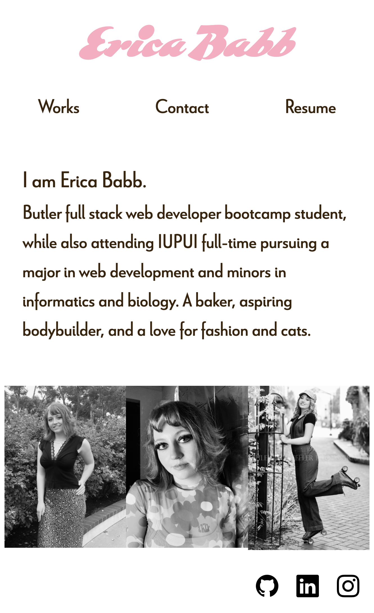
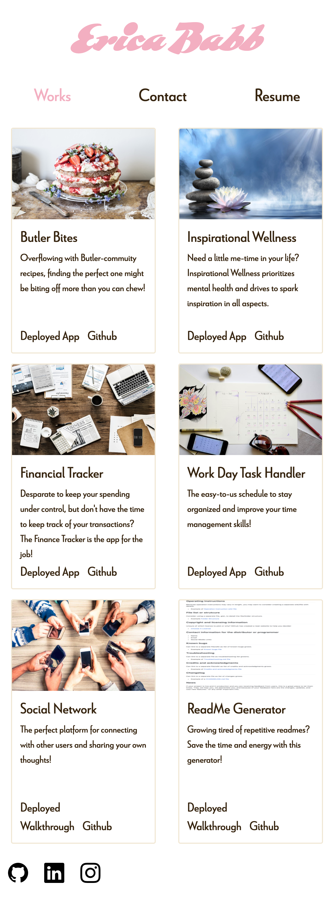
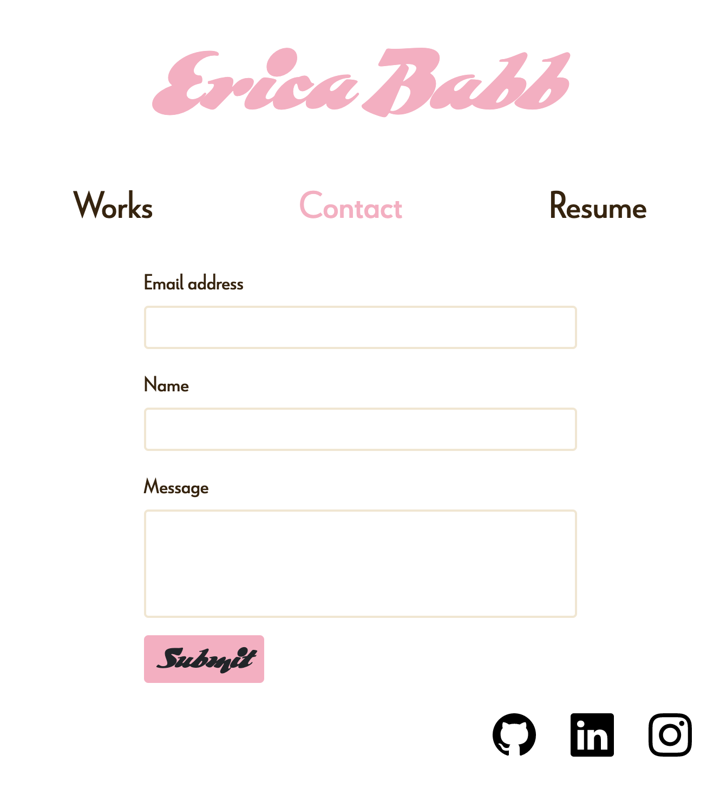
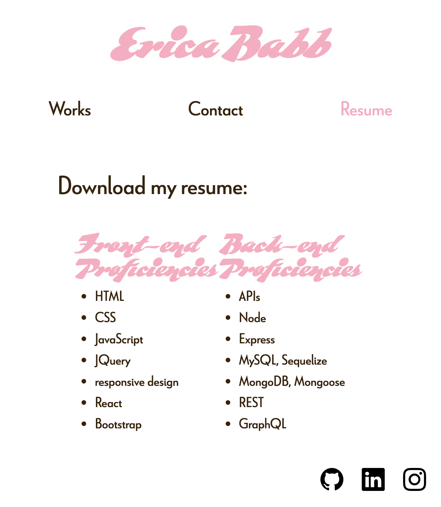

# React Portfolio

## Description

My new, updated portfolio made with React! This portfolio displays a bit about myself, my work, and how to contact me.

## Table of Contents

- [Installation](#installation)
- [Usage](#usage)
- [License](#license)
- [Contributing](#contributing)
- [Questions](#questions)

## Installation

Clone this repo using the git clone command! Once cloned, download the necessary dependencies listed in the package.json file.

## Usage

Start your local host with "npm start."

## License

## Contributing

EricaBabb

## Questions

Github: EricaBabb
Email: ecamilebabb@gmail.com
